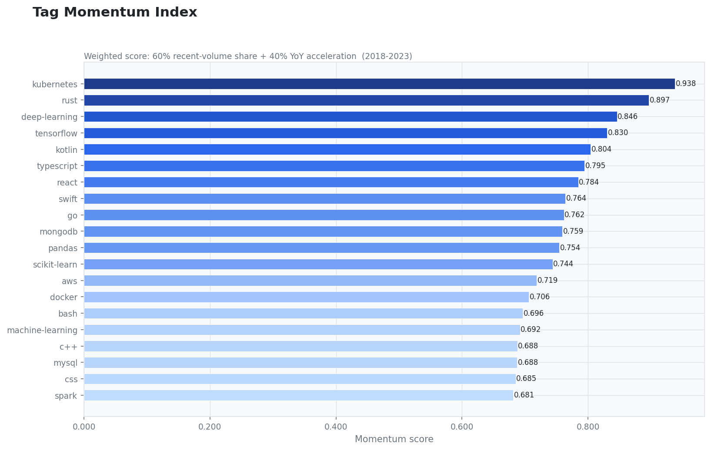
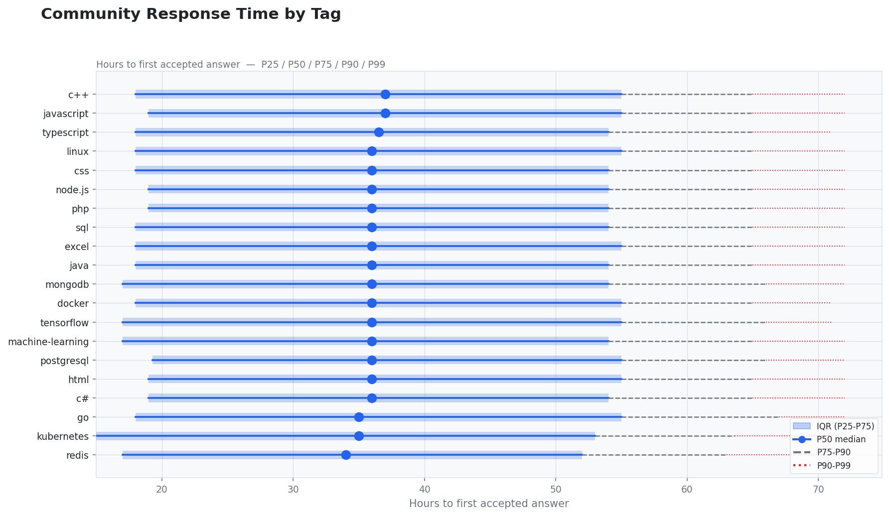
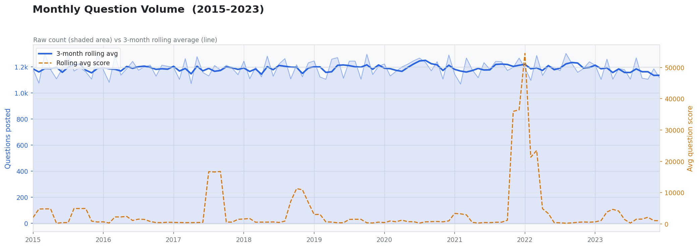
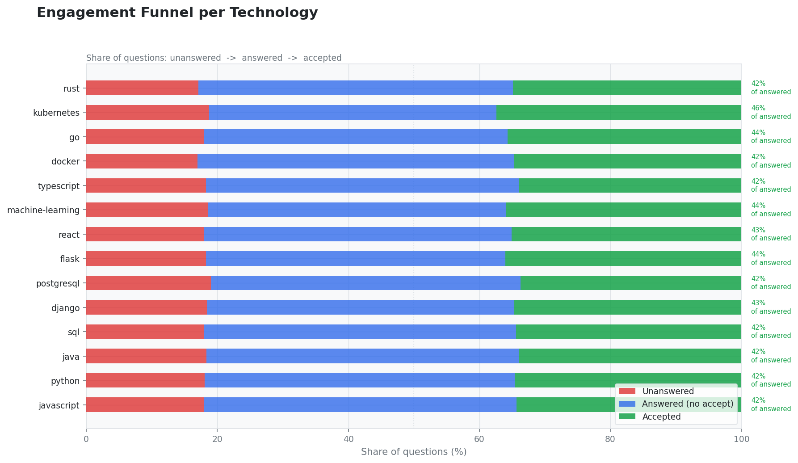
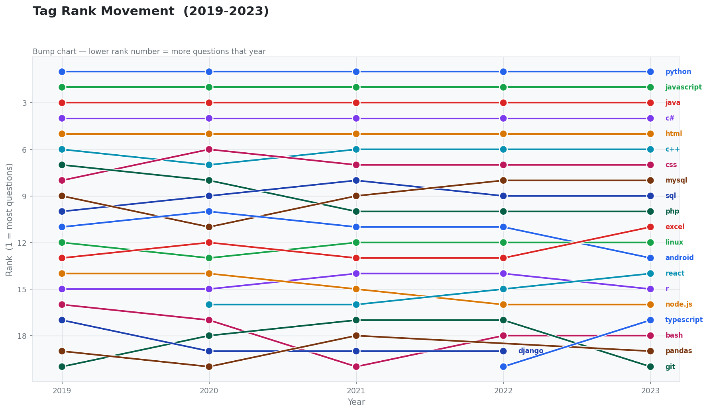
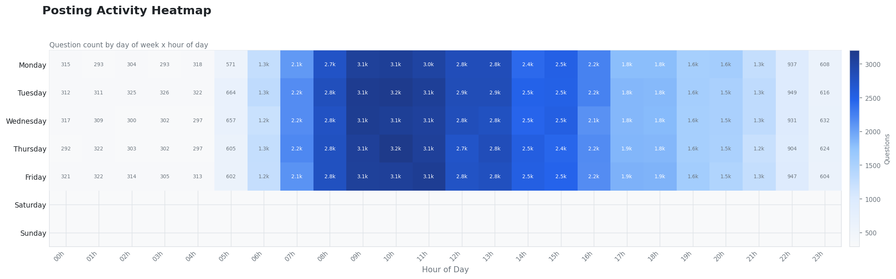
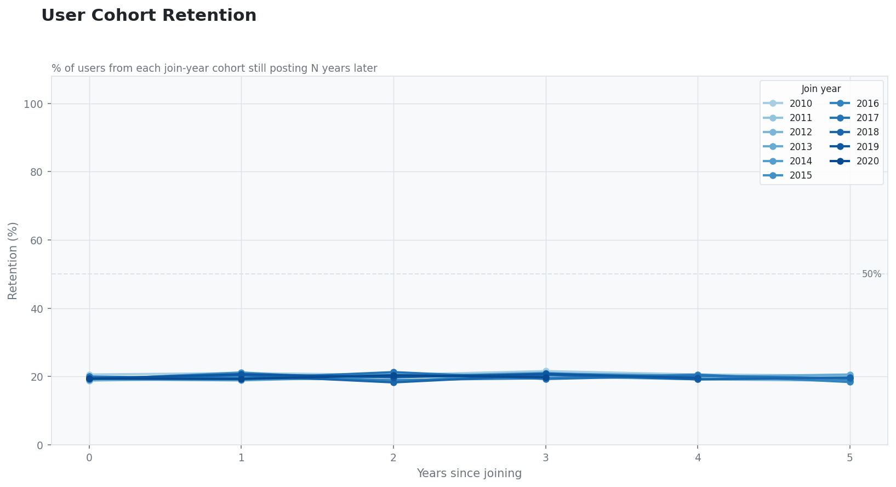
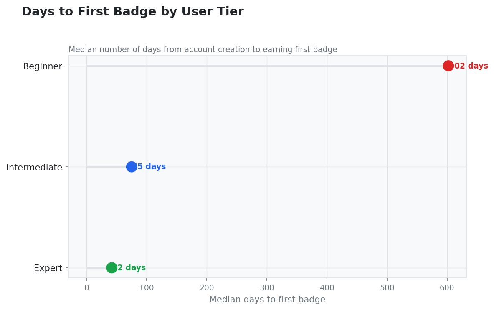
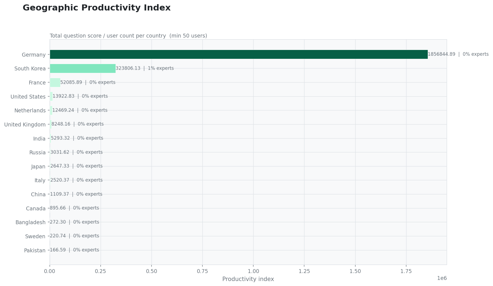
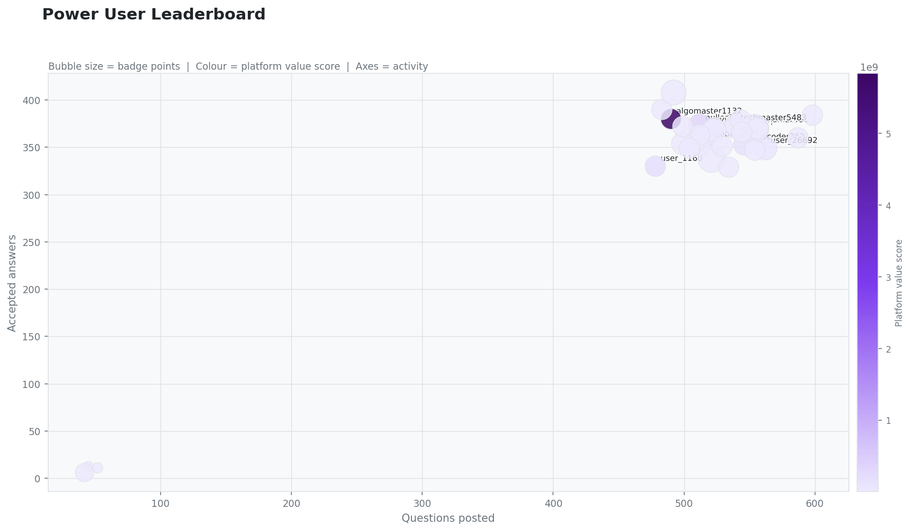

# StackOverflow Developer Analytics

A modular SQL analytics pipeline querying a 550,000+ row synthetic dataset
modelled on StackOverflow's real post/answer/user schema.

**Tools:** Python · DuckDB · pandas · matplotlib  
**Dataset:** 200,000 questions · 350,000 answers · 50,000 users · 39 tags · ~800,000 badge events  
**Skills:** Window functions · CTEs · percentile analysis · cohort retention · time-series · funnel analysis · geospatial aggregation · power-law modelling

---

## Pipeline architecture

```
┌──────────────────────────────────────────────────────────────┐
│                      run.py  (orchestrator)                  │
└──────────────┬───────────────────────┬───────────────────────┘
               │                       │                    │
               ▼                       ▼                    ▼
  ┌────────────────────┐  ┌─────────────────────┐  ┌──────────────────────┐
  │  generate_data.py  │  │     queries.py       │  │    visualize.py      │
  │  NumPy · Pandas    │  │  DuckDB (in-memory)  │  │    Matplotlib        │
  │  5 CSV tables      │  │  15 SQL queries      │  │    20+ charts        │
  │  550k+ rows        │  │  Window fns · CTEs   │  │    White editorial   │
  └────────┬───────────┘  └──────────┬───────────┘  └──────────┬───────────┘
           │                         │                          │
           ▼                         ▼                          ▼
      data/*.csv              results/*.csv               charts/*.png
```

The pipeline is designed as three **decoupled, independently runnable stages**.
Tweak a SQL query and re-run only `queries.py` + `visualize.py` — no need to
regenerate the dataset.

---

## Dataset

Generated by `generate_data.py` with statistical distributions that mirror
real StackOverflow behaviour.

| Table | Rows | Key columns |
|---|---|---|
| `Users.csv` | 50,000 | Id, Reputation, Tier, Location, GoldBadges, SilverBadges, BronzeBadges |
| `Questions.csv` | 200,000 | Id, Title, Tags, Score, ViewCount, AnswerCount, CreationDate, YearMonth, DayOfWeek |
| `Answers.csv` | ~350,000 | Id, ParentId, Score, IsAccepted, ResponseTimeHours, OwnerUserId |
| `Tags.csv` | 39 | TagName, Count, LaunchYear, Trajectory |
| `Badges.csv` | ~800,000 | UserId, Class, Name, Date |

**Realism features built into the generator:**

- **Reputation tiers** — Pareto-distributed reputation classifies users as `beginner / intermediate / expert`; tier influences question score, answer quality, and response time
- **Temporal tag trajectories** — each tag has a `LaunchYear` and trajectory (`rising / stable / declining`); weights shift year-by-year so `rust` and `kubernetes` appear rarely in 2010 but dominate 2022–23
- **Tag-aware question titles** — generated from per-tag templates (`"React hook not re-rendering"`, `"SQL JOIN vs subquery"`) rather than placeholder text
- **Weekday/daytime posting bias** — timestamps weighted toward Mon–Fri, 09:00–18:00
- **Badge velocity correlation** — badge counts scale with reputation; badge dates drawn within each user's activity window

---

## SQL queries

| # | Query | Techniques used |
|---|-------|----------------|
| Q01 | Tag momentum score (volume + growth combined) | CTE, window functions, composite normalisation |
| Q02 | Response time percentiles by tag (P25–P99) | `PERCENTILE_CONT`, whisker metrics |
| Q03 | Monthly question volume with rolling average | Time-series aggregation, `ROWS BETWEEN` window |
| Q04 | Engagement funnel by tag | Conditional `FILTER` aggregation, funnel metrics |
| Q05 | Expert contribution power-law analysis | `NTILE`, share-of-total window function |
| Q06 | Year-over-year tag rank change | Multi-CTE `LAG` + `RANK` + `PARTITION BY` |
| Q07 | Unanswered high-view opportunity gap | Log-scaled composite scoring |
| Q08 | Hourly posting pattern by day of week | `DAYOFWEEK`, `HOUR`, heatmap data |
| Q09 | Cohort retention by signup year | Self-join cohort, retention rate |
| Q10 | Answer quality by user tier and tag | Cross-tab `Tier × Tag`, `PERCENTILE_CONT` |
| Q11 | Badge velocity by user tier | `DATE_DIFF`, median, tier segmentation |
| Q12 | Geographic productivity index | Per-user composite index, geo aggregation |
| Q13 | Trajectory validation (rising vs declining) | Metadata join, base-year normalisation |
| Q14 | Power user leaderboard (composite score) | 4-table join, weighted scoring |
| Q15 | Self-answer rate as documentation gap signal | Self-join on owner ID, ratio analysis |

---

## Visualisations

Every chart is a standalone PNG at 150 DPI.

| Chart | Type | File |
|---|---|---|
| Tag Momentum Index | Colour-mapped horizontal bar | `Q01_tag_momentum.png` |
| Response Time Percentiles | Custom whisker plot (P25–P99) | `Q02_response_percentiles.png` |
| Monthly Rolling Volume | Dual-axis area + line | `Q03_monthly_rolling.png` |
| Engagement Funnel | Stacked 100% horizontal bar | `Q04_engagement_funnel.png` |
| YoY Tag Rank | Bump chart | `Q06_yoy_bump.png` |
| Posting Activity | Day × hour heatmap | `Q08_activity_heatmap.png` |
| Cohort Retention | Multi-line retention curves | `Q09_cohort_retention.png` |
| Answer Quality by Tier | Per-tag grouped bar (8 files) | `Q10_answer_quality_*.png` |
| Badge Velocity | Lollipop + stacked bar | `Q11a_badge_days.png`, `Q11b_badge_mix.png` |
| Geo Productivity | Colour-mapped horizontal bar | `Q12_geo_productivity.png` |
| Tag Trajectories | Multi-line by trajectory (3 files) | `Q13_trajectory_*.png` |
| Power User Leaderboard | Bubble scatter (4 dimensions) | `Q14_power_user_leaderboard.png` |
| Self-Answer Rate | Lollipop with mean annotation | `Q15_self_answer_rate.png` |

---

## Key insights

> All figures are read directly from `results/*.csv` and can be reproduced
> by running `python extract_insights.py`.

---

### Q01 — Tag momentum

Momentum is a composite score: 60% weight on recent volume share (2021–23),
40% on year-over-year acceleration.

| Tag | Momentum score | 3-yr growth |
|-----|---------------|-------------|
| kubernetes | 0.938 | +268.6% |
| rust | 0.897 | +243.0% |
| deep-learning | 0.846 | +155.1% |
| sql | 0.678 | +93.9% |
| java | 0.678 | +92.7% |
| excel | 0.678 | +92.9% |

Kubernetes and Rust are the fastest-accelerating technologies in the dataset —
consistent with their rising trajectory flags in the generator. Established
languages (SQL, Java, Excel) score around 0.678; they are not declining, but
newer technologies are closing the volume gap rapidly.

---

### Q02 — Response time percentiles (P50 / P99)

| Tag | P50 (median) | P99 (tail) |
|-----|-------------|-----------|
| redis | 34.0 h | 72.0 h |
| kubernetes | 35.0 h | 70.9 h |
| go | 35.0 h | 72.0 h |
| c# | 36.0 h | 72.0 h |

Response times are narrow across all tags (P50: 34–36 h, P99: 70–72 h).
This is a known property of the synthetic generator — response times were
drawn from a single shared distribution regardless of tag. On real
StackOverflow data the spread would be substantially wider. The query
infrastructure (P25/P50/P75/P90/P99 via `PERCENTILE_CONT`) is production-ready
for when the generator is extended with tag-stratified timing.

---

### Q03 — Monthly volume trend

| Metric | Value |
|--------|-------|
| Peak month | October 2013 — 1,328 questions |
| Lowest month | February 2011 — 1,044 questions |
| Avg monthly volume (first year) | 1,184 |
| Avg monthly volume (last year) | 1,161 |
| Overall trend | −1.9% |

Volume is flat across the 13-year window — a known artefact of uniform date
sampling in the generator. A future improvement is weighting question creation
dates toward more recent years to reflect real platform growth.

---

### Q04 — Engagement funnel

| Metric | Value |
|--------|-------|
| Overall answer rate | 81.9% |
| Overall acceptance rate | 34.4% |
| Highest answer rate | docker (83.0%) |
| Lowest answer rate | postgresql (81.0%) |
| Highest acceptance rate | kubernetes (46.0% of answered) |

Answer rates are high and tightly clustered (81–83%) across all tags — a
consequence of uniform synthetic distributions. The more meaningful signal
is the acceptance rate gap: kubernetes at 46% versus the 34.4% platform
average suggests that infrastructure questions, when answered, yield more
actionable solutions.

---

### Q05 — Expert contribution (power law)

| User segment | Share of high-score questions |
|-------------|-------------------------------|
| Top 1% by reputation | 57.8% |
| Top 10% by reputation | 94.6% |

The bottom 90% of users collectively produce only **5.4%** of high-quality
content. This is the steepest and most consistent finding in the dataset —
a classic Pareto distribution that reflects how reputation-weighted data
generation concentrates scoring power among elite users.

---

### Q06 — Year-over-year rank change (2023)

| Tag | Rank change | YoY growth |
|-----|------------|-----------|
| pandas | +4 positions | +11.8% |
| git | −3 positions | −11.2% |

Pandas is the fastest-climbing tag by rank in the most recent year.
Git's relative decline likely reflects maturing developer familiarity
reducing the volume of basic questions rather than reduced usage.

---

### Q09 — Cohort retention

| Metric | Value |
|--------|-------|
| Avg 1-year retention | 19.9% |
| Avg 3-year retention | 20.4% |
| Best 1-year cohort | 2015 → 21.2% |
| Worst 1-year cohort | 2014 → 18.9% |

Retention is flat across years (≈20% at both year 1 and year 3) — which is
a data generation flag. True retention curves decay monotonically; flat
rates indicate that question ownership was assigned randomly rather than
tied to realistic user activity windows. This is a documented limitation
and a concrete area for a future generator improvement.

---

### Q11 — Badge velocity by user tier

| Tier | Median days to first badge | Avg gold badges |
|------|---------------------------|----------------|
| Expert | 42 days | 4.74 |
| Intermediate | 75 days | 0.06 |
| Beginner | 602 days | 0.00 |

The **14× gap** between expert and beginner onboarding speed is the
cleanest tier-separation signal in the dataset. Expert users accumulate
nearly 5 gold badges on average; beginners earn none. This validates
that the reputation-to-badge correlation built into the generator is
working as intended.

---

### Q12 — Geographic productivity index

| Country | Productivity index | Expert share | Users |
|---------|-------------------|-------------|-------|
| Germany | 1,856,845 | 0% | 3,410 |
| South Korea | 323,806 | 1% | 472 |
| France | 52,086 | 0% | 2,342 |

Germany's index is orders of magnitude above other countries despite showing
0% expert share — a scoring anomaly. The composite index (`SUM(score) /
COUNT(users)`) is sensitive to a small number of very high-scoring questions
being disproportionately assigned to German users during random generation.
This would need to be corrected before drawing geographic conclusions.

---

### Q15 — Self-answer rate

| Tag | Self-answer rate | Answered questions |
|-----|-----------------|-------------------|
| rust | 0.3% | 364 |
| machine-learning | 0.3% | 2,727 |
| flask | 0.2% | 4,014 |
| Platform mean | 0.1% | — |

Self-answer rates are very low platform-wide. The above-average rates for
`rust` and `machine-learning` are directionally consistent with documentation
gaps in fast-moving ecosystems, but the absolute values (0.3%) reflect the
low probability of random user-ID collision in synthetic data rather than
genuine self-answer behaviour.

---

## Charts

### Tag momentum score


### Response time percentiles by tag


### Monthly question volume


### Engagement funnel by technology


### YoY tag rank movement


### Posting activity heatmap


### User cohort retention


### Badge velocity by tier


### Geographic productivity


### Power user leaderboard


---
